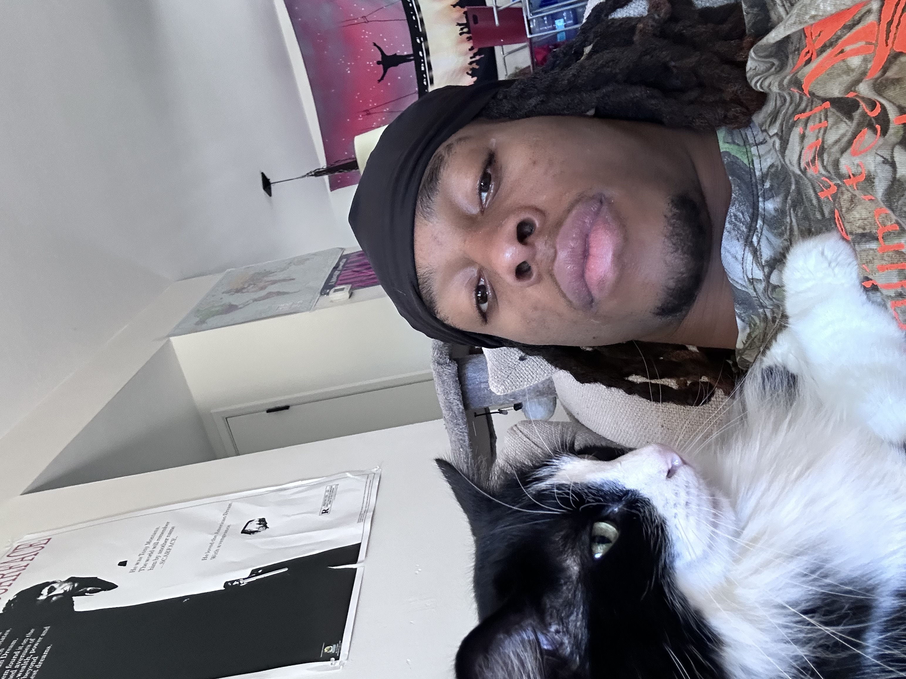

## WELCOME TO SOMTOCHUKWU IKEANYI's FIRST WEBSITE
Hello, I am **Somtochukwu (Somto) Ikeanyi**, I am a 4th year Bioengineering:Bioinformatics student attending the University of California, San Diego.
[Jump to Bioinformatic Coding Demo](#minor-coding-demo-to-demonstrate-bioinformatics-knowledge)
-----------------------------
# WHO AM I?

I was born and raised in Los Angeles County. Growing up I am not gonna lie I didn't think my path would lead me to Bioengineering, but I am happy it did. I am eager to be apart of this emerging field as soon as I graduate!
-----------------------------
## I read this first thing in the morning, every morning:
>"Why seek validation from a world who persecuted a perfect man" - Paul
-----------------------------
### My Favorite Programming Languages:
- Python
- JavaScript
- C++
- BLAST and ClustalW
- React
- Git
 (In that exact order)

-----------------------------
 ### MY Favorite Foods:
 1. Japanese food
 2. Italian food
 3. Mexican food
-----------------------------
# Some of my most frequented websites:
-[Youtube](https://www.youtube.com/)
-[Netflix](https://www.netflix.com/)
-[Github](https://github.com/Somtoik)

-----------------------------
### TODOLIST QUARTER:
-[] Internship
-[] Commencement 
-[x] Beach More
-[x] Spend More time with international friends that may be leaving in the coming future

-----------------------------
### Minor Coding Demo To Demonstrate Bioinformatics knowledge
```python
def gccont(seq):
    gc=seq.count("G")+seq.count("C")
    return round((gc/len(seq))*100,2)
print (gccont("ATCTCTATGTGGTTGGGAAGTCATG"))


